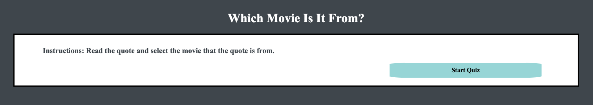
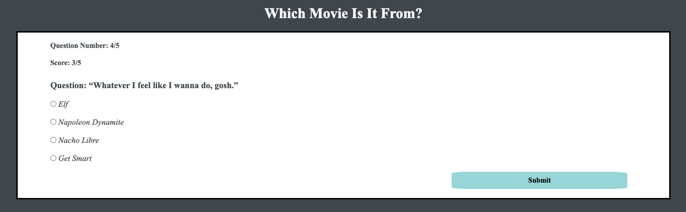
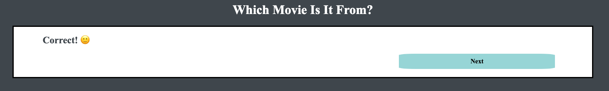
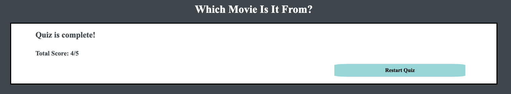

# Quizz-App

A Thinkful assignment.

## Live Demo

[Live Demo](https://7424243.github.io/quizz-app/)

## Screenshots

### Landing Page:

### Question Page:

### Feedback Page:

### Final Score Page:

## Summary

A fun, interactive quiz app regarding movie quotes. Users are presented with a total of 5 questions and they have to guess which movie a quote is from. After each submit, the user is given feedback on whether or not their answer was correct or not. If their answer was incorrect, they are given feedback with the correct answer. As the user goes through the quiz, they can see what question they are currently on and their current score. At the end of the quiz, the user is presented with their final score and given the opportunity to restart.

## Built With

* HTML
* CSS
* JavaScript
* jQuery
